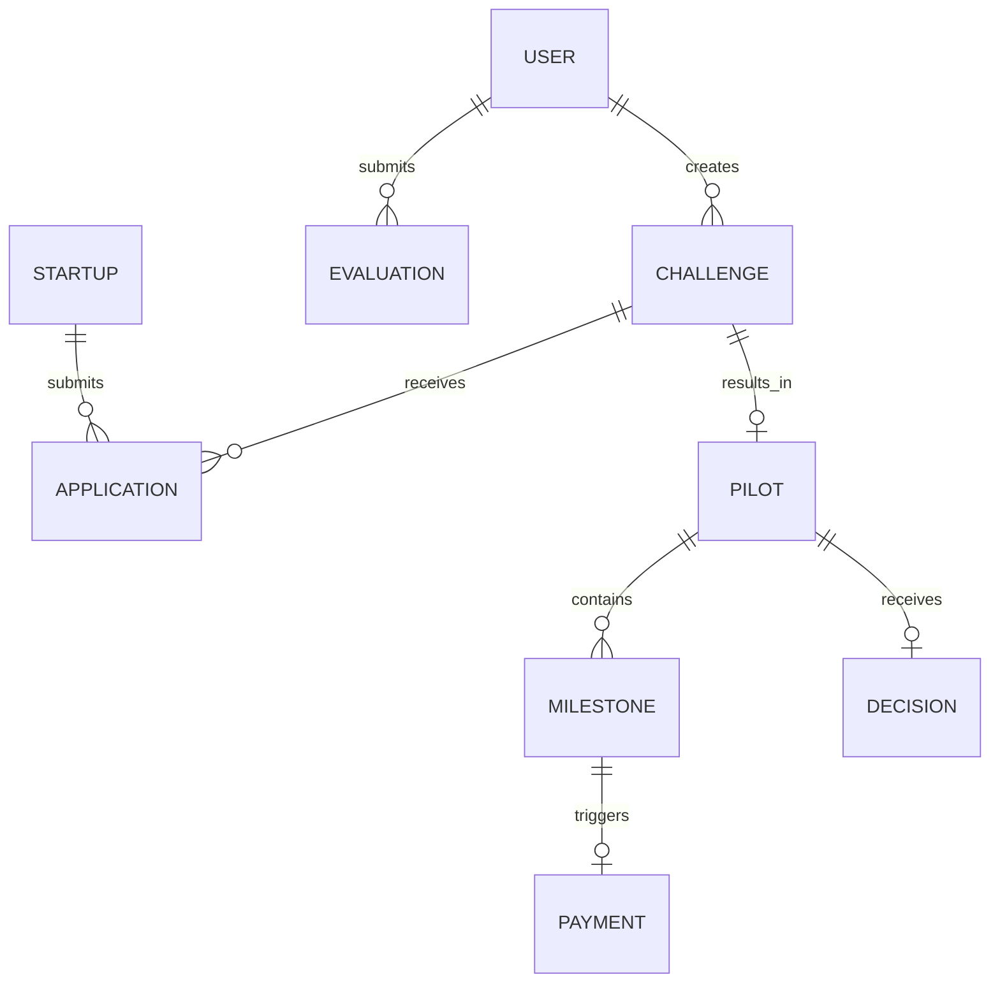

# InnoProcure — Backend Developer Integration & API Contract Guide

This document is the official backend developer handoff guide for **InnoProcure**, a government-to-startup innovation procurement and piloting platform.

The frontend is complete, fully functional, and engineered with a clean modular service layer (`src/services/`) and centralized React Context state (`src/context/AppContext.jsx`). 

This guide details the application architecture, entity models, REST API endpoints, status enums, authentication rules, database schema recommendations, and exact frontend replacement points.

---

## 1. Application Architecture & Data Flow

### Key Roles
1. **Government Officer (`government`)**: Defines problem statements, sets measurable outcome targets and budget, creates challenges, reviews pilot results, and executes final Go/No-Go scale-up decisions.
2. **Technical Evaluator (`evaluator`)**: Scores startup proposals using a 5-criterion rubric, signs off on conflict-of-interest declarations, shortlists winning startups, and audits milestone evidence.
3. **Startup Founder (`startup`)**: Registers DPIIT profile, discovers public challenges, submits detailed technical proposals, executes pilot deliverables, and uploads milestone evidence.
4. **System Admin (`admin`)**: Provisions users, manages role assignments, monitors challenge registries, and views global audit trails.
5. **Public Transparency Portal (`public`)**: Read-only public view displaying challenge goals, outcome targets, milestone verification progress, and scale-up decisions without revealing confidential startup IP or proposal details.

### Component Structure
```text
src/
  components/
    DemoHeaderBanner.jsx      # Instant role-switcher banner for demos
    Navbar.jsx                # Branding, public view toggle, notification alerts
    StatusBadge.jsx           # Uniform public sector status styling
    Logo.jsx                  # Official public portal emblem logo
    DashboardLayout.jsx       # Shared dashboard container & sidebars
    PilotAgreementModal.jsx   # Tripartite pilot agreement contract modal
    sidebars/                 # Role-specific sidebar navigation menus
  context/
    AppContext.jsx            # Central state store with localStorage sync & event loggers
  data/
    mockData.js               # Initial seed data for Indian government departments & startups
  services/
    challengeService.js       # Challenge API service wrapper
    applicationService.js     # Proposal & application API service wrapper
    pilotService.js           # Pilot & milestone verification service wrapper
    userService.js            # User & startup profile service wrapper
    activityService.js        # Audit trail logging service wrapper
  pages/
    auth/                     # Login & role selector
    government/               # Officer dashboard, creation wizard, details, final decision
    evaluator/                # Evaluator dashboard, rubric scoring, shortlisting, milestone audit
    startup/                  # Startup dashboard, challenge discovery, proposal submission, profile, evidence upload
    admin/                    # User provisioning, challenge registry, analytics, settings
    public/                   # Public transparency portal
```

---

## 2. Entity Schemas & Relationships



### Entity Field Specifications

#### `User`
- `id`: String (UUID or `usr_...`)
- `name`: String
- `email`: String (Unique)
- `role`: Enum (`"government" | "evaluator" | "startup" | "admin"`)
- `department`: String (Government Ministry or Institution)
- `designation`: String
- `avatar`: String (URL)

#### `Startup`
- `id`: String (UUID or `start_...`)
- `userId`: Foreign key -> `User.id`
- `companyName`: String
- `dpiitNumber`: String (DPIIT recognition number)
- `foundingYear`: String
- `headquarters`: String
- `shortDescription`: Text
- `capabilities`: Array of Strings
- `technologyAreas`: Array of Strings
- `pastExperience`: Text
- `teamSize`: Integer
- `website`: String
- `contactEmail`: String
- `contactPhone`: String

#### `Challenge`
- `id`: String (UUID or `ch_...`)
- `title`: String
- `department`: String
- `category`: String
- `problemStatement`: Text
- `desiredOutcome`: Text
- `measurableOutcomeTarget`: Text (Metric target e.g. "Reduce NRW loss from 38% to 15%")
- `budget`: String / Numeric (₹)
- `timelineDays`: Integer
- `applicationDeadline`: Date String
- `dataSensitivity`: Enum (`"LOW" | "MEDIUM" | "HIGH"`)
- `requiredCapabilities`: Array of Strings
- `status`: Enum (`"DRAFT" | "OPEN" | "CLOSED" | "IN_EVALUATION" | "PILOT_IN_PROGRESS" | "COMPLETED" | "SCALED" | "REJECTED"`)
- `createdDate`: Date String
- `createdBy`: String (`User.name`)
- `evaluatorId`: Foreign key -> `User.id`
- `applicationsCount`: Integer
- `shortlistedStartupId`: Foreign key -> `Startup.id` (Nullable)

#### `Application` (Proposal)
- `id`: String (UUID or `app_...`)
- `challengeId`: Foreign key -> `Challenge.id`
- `startupId`: Foreign key -> `Startup.id`
- `startupName`: String
- `submissionDate`: Date String
- `proposedSolution`: Text
- `implementationApproach`: Text
- `expectedOutcome`: Text
- `timelineDays`: Integer
- `requestedBudget`: String / Numeric (₹)
- `relevantExperience`: Text
- `status`: Enum (`"SUBMITTED" | "UNDER_EVALUATION" | "SHORTLISTED" | "REJECTED" | "PILOT"`)
- `score`: Integer (0 - 100, Nullable)
- `evaluationComments`: Text
- `scoredDate`: Date String (Nullable)
- `scoredBy`: String (Nullable)

#### `Pilot`
- `id`: String (UUID or `pilot_...`)
- `challengeId`: Foreign key -> `Challenge.id`
- `applicationId`: Foreign key -> `Application.id`
- `startupId`: Foreign key -> `Startup.id`
- `startupName`: String
- `department`: String
- `challengeTitle`: String
- `startDate`: Date String
- `expectedCompletionDate`: Date String
- `totalBudget`: String / Numeric (₹)
- `status`: Enum (`"IN_PROGRESS" | "AWAITING_FINAL_DECISION" | "SCALED" | "REJECTED"`)
- `agreementSigned`: Boolean
- `agreementDate`: Date String

#### `Milestone`
- `id`: String (UUID or `ms_...`)
- `pilotId`: Foreign key -> `Pilot.id`
- `title`: String
- `description`: Text
- `dueDate`: Date String
- `amount`: String / Numeric (₹)
- `status`: Enum (`"PENDING" | "SUBMITTED" | "UNDER_VERIFICATION" | "VERIFIED" | "INCOMPLETE"`)
- `paymentStatus`: Enum (`"PENDING" | "RELEASED"`)
- `evidenceUrl`: String (Document URL)
- `evidenceNotes`: Text
- `submittedDate`: Date String (Nullable)
- `verifiedDate`: Date String (Nullable)
- `verifiedBy`: String (Nullable)
- `verificationComments`: Text

#### `ActivityLog`
- `id`: String
- `timestamp`: Date/Time String
- `actor`: String
- `role`: String
- `action`: String
- `details`: Text

---

## 3. Recommended REST API Endpoints

### Authentication & Users
- `POST /api/auth/login` — Authenticate user and return JWT token + user profile.
- `GET /api/users` — List all system users (Admin only).
- `POST /api/users` — Provision new user account (Admin only).
- `GET /api/startups/profile` — Get current logged-in startup profile.
- `PUT /api/startups/profile` — Update startup capabilities & DPIIT info.

### Challenges
- `GET /api/challenges` — List public procurement challenges (supports query params `?category=...&search=...`).
- `POST /api/challenges` — Create new challenge (Govt Officer only).
- `GET /api/challenges/:id` — Get single challenge details.
- `PATCH /api/challenges/:id` — Update challenge status.

### Proposals / Applications
- `GET /api/challenges/:id/applications` — List submitted proposals for a challenge.
- `POST /api/challenges/:id/applications` — Submit new proposal (Startup only).
- `POST /api/applications/:id/score` — Submit rubric evaluation score (Evaluator only).
- `POST /api/applications/:id/shortlist` — Shortlist candidate & generate pilot contract.

### Pilots & Milestones
- `GET /api/pilots/:id` — Get pilot execution details and agreement contract data.
- `POST /api/pilots/:id/milestones/:msId/evidence` — Submit milestone evidence (Startup only).
- `PATCH /api/pilots/:id/milestones/:msId/verify` — Verify milestone complete/incomplete (Evaluator only).
- `PATCH /api/pilots/:id/milestones/:msId/payment` — Update milestone payment status to RELEASED.
- `POST /api/pilots/:id/decision` — Submit final Go/No-Go scale-up or rejection order (Govt Officer only).

### Audit Trail
- `GET /api/activity` — Fetch real-time audit event stream.

---

## 4. Sample JSON Payloads

### `POST /api/challenges` (Create Challenge)
```json
{
  "title": "AI-Assisted Rural Health Cold Chain Telemetry Pilot",
  "department": "Ministry of Health & Family Welfare",
  "category": "Healthcare & MedTech",
  "problemStatement": "Remote PHCs experience power disruptions leading to unmonitored vaccine thermal drift.",
  "desiredOutcome": "Off-grid telemetry nodes with cellular/satellite alert failover.",
  "measurableOutcomeTarget": "Maintain vaccine temperatures strictly within 2°C to 8°C with breach notifications under 120s.",
  "budget": "35,00,000",
  "timelineDays": 90,
  "applicationDeadline": "2026-10-30",
  "dataSensitivity": "MEDIUM",
  "requiredCapabilities": ["Medical Devices", "IoT Telemetry", "Offline-first Sync"]
}
```

### `POST /api/applications/:id/score` (Evaluator Rubric Score)
```json
{
  "score": 92,
  "rubricBreakdown": {
    "problemUnderstanding": 18,
    "techFeasibility": 19,
    "expectedImpact": 19,
    "capability": 18,
    "valueForMoney": 18
  },
  "evaluationComments": "High acoustic precision and validated field trial in Mysuru. Recommended for shortlisting.",
  "noConflictSignoff": true
}
```

### `POST /api/pilots/:id/decision` (Final Officer Order)
```json
{
  "decision": "SCALED",
  "comments": "Pilot achieved 63% NRW loss reduction in Ward 42. Approved for direct scale-up under GFR Rule 194.",
  "scaledDepartments": [
    "BWSSB Ward 43-56",
    "Mysuru Urban Water Supply Board",
    "Hubballi-Dharwad Municipal Corporation"
  ]
}
```

---

## 5. Status Enums Summary

| Domain | Status Enum Values |
|---|---|
| **Challenge** | `DRAFT`, `OPEN`, `CLOSED`, `IN_EVALUATION`, `PILOT_IN_PROGRESS`, `COMPLETED`, `SCALED`, `REJECTED` |
| **Application** | `SUBMITTED`, `UNDER_EVALUATION`, `SHORTLISTED`, `REJECTED`, `PILOT`, `COMPLETED` |
| **Milestone** | `PENDING`, `SUBMITTED`, `UNDER_VERIFICATION`, `VERIFIED`, `INCOMPLETE` |
| **Payment** | `PENDING`, `RELEASED` |
| **Data Sensitivity** | `LOW`, `MEDIUM`, `HIGH` |

---

## 6. Auth & Authorization Matrix

| Route Group | Allowed Roles | Access Type |
|---|---|---|
| `/government/*` | `government`, `admin` | Full Read/Write |
| `/evaluator/*` | `evaluator`, `admin` | Full Read/Write |
| `/startup/*` | `startup`, `admin` | Full Read/Write |
| `/admin/*` | `admin` | Full Read/Write |
| `/public/*` | Anyone (Unauthenticated) | Read-Only Restricted |

---

## 7. Frontend Replacement Instructions for Backend Developer

To wire real API endpoints to the frontend, replace the functions in `src/services/` with real HTTP clients (e.g. `axios` or `fetch`).

### Example Replacement in `src/services/challengeService.js`:

**Current Mock Code:**
```js
export const mockChallengeService = {
  async getChallenges(context) {
    return context.challenges;
  },
  async createChallenge(context, challengeData) {
    return context.createChallenge(challengeData);
  }
};
```

**Backend API Replacement:**
```js
import api from "./apiClient";

export const challengeService = {
  async getChallenges() {
    const res = await api.get('/challenges');
    return res.data;
  },
  async createChallenge(challengeData) {
    const res = await api.post('/challenges', challengeData);
    return res.data;
  }
};
```

---

## 8. Suggested PostgreSQL Database Schema

```sql
-- Users Table
CREATE TABLE users (
    id VARCHAR(64) PRIMARY KEY,
    name VARCHAR(255) NOT NULL,
    email VARCHAR(255) UNIQUE NOT NULL,
    password_hash VARCHAR(255) NOT NULL,
    role VARCHAR(32) NOT NULL,
    department VARCHAR(255),
    designation VARCHAR(255),
    created_at TIMESTAMP DEFAULT CURRENT_TIMESTAMP
);

-- Startups Table
CREATE TABLE startups (
    id VARCHAR(64) PRIMARY KEY,
    user_id VARCHAR(64) REFERENCES users(id),
    company_name VARCHAR(255) NOT NULL,
    dpiit_number VARCHAR(128) NOT NULL,
    founding_year VARCHAR(32),
    headquarters VARCHAR(255),
    short_description TEXT,
    capabilities TEXT[],
    created_at TIMESTAMP DEFAULT CURRENT_TIMESTAMP
);

-- Challenges Table
CREATE TABLE challenges (
    id VARCHAR(64) PRIMARY KEY,
    title VARCHAR(255) NOT NULL,
    department VARCHAR(255) NOT NULL,
    category VARCHAR(128) NOT NULL,
    problem_statement TEXT NOT NULL,
    desired_outcome TEXT NOT NULL,
    measurable_outcome_target TEXT NOT NULL,
    budget NUMERIC(12,2) NOT NULL,
    timeline_days INT NOT NULL,
    application_deadline DATE NOT NULL,
    data_sensitivity VARCHAR(32) DEFAULT 'LOW',
    required_capabilities TEXT[],
    status VARCHAR(64) DEFAULT 'OPEN',
    created_by VARCHAR(64) REFERENCES users(id),
    created_at TIMESTAMP DEFAULT CURRENT_TIMESTAMP
);

-- Applications Table
CREATE TABLE applications (
    id VARCHAR(64) PRIMARY KEY,
    challenge_id VARCHAR(64) REFERENCES challenges(id),
    startup_id VARCHAR(64) REFERENCES startups(id),
    proposed_solution TEXT NOT NULL,
    implementation_approach TEXT NOT NULL,
    expected_outcome TEXT NOT NULL,
    requested_budget NUMERIC(12,2) NOT NULL,
    timeline_days INT NOT NULL,
    status VARCHAR(64) DEFAULT 'SUBMITTED',
    score INT,
    evaluation_comments TEXT,
    created_at TIMESTAMP DEFAULT CURRENT_TIMESTAMP
);

-- Pilots Table
CREATE TABLE pilots (
    id VARCHAR(64) PRIMARY KEY,
    challenge_id VARCHAR(64) REFERENCES challenges(id),
    application_id VARCHAR(64) REFERENCES applications(id),
    startup_id VARCHAR(64) REFERENCES startups(id),
    total_budget NUMERIC(12,2) NOT NULL,
    status VARCHAR(64) DEFAULT 'IN_PROGRESS',
    agreement_signed BOOLEAN DEFAULT TRUE,
    agreement_date DATE,
    created_at TIMESTAMP DEFAULT CURRENT_TIMESTAMP
);

-- Milestones Table
CREATE TABLE milestones (
    id VARCHAR(64) PRIMARY KEY,
    pilot_id VARCHAR(64) REFERENCES pilots(id),
    title VARCHAR(255) NOT NULL,
    description TEXT,
    due_date DATE,
    amount NUMERIC(12,2) NOT NULL,
    status VARCHAR(64) DEFAULT 'PENDING',
    payment_status VARCHAR(64) DEFAULT 'PENDING',
    evidence_url VARCHAR(512),
    evidence_notes TEXT,
    verification_comments TEXT,
    created_at TIMESTAMP DEFAULT CURRENT_TIMESTAMP
);

-- Audit Log Table
CREATE TABLE activity_logs (
    id VARCHAR(64) PRIMARY KEY,
    timestamp TIMESTAMP DEFAULT CURRENT_TIMESTAMP,
    actor VARCHAR(255) NOT NULL,
    role VARCHAR(64) NOT NULL,
    action VARCHAR(128) NOT NULL,
    details TEXT NOT NULL
);
```

---

## Summary
The frontend is completely wired and ready for demonstration or immediate backend integration. Any backend developer can replace the mock service implementations in `src/services/` by matching the REST endpoint contracts defined above.
